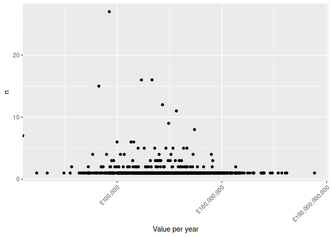
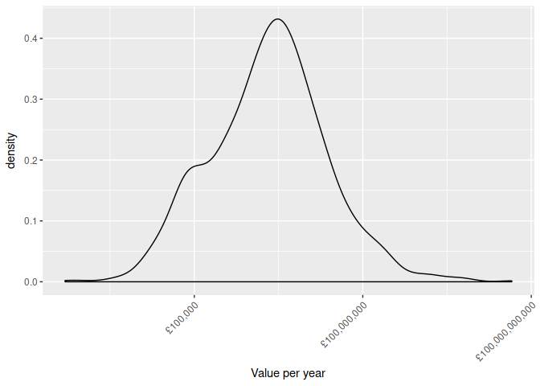

Exploratory analysis of government grant schemes
================
Thu Feb 15 13:04:45 2018

``` r
# Render to HTML with
# rmarkdown::render("R/explore-schemes.R")

library(tidyverse)
library(scales)
library(here)

path201314 <- here("lists", "government-grant-schemes-2013-14.csv")
path201415 <- here("lists", "government-grant-schemes-2014-15.csv")
path201516 <- here("lists", "government-grant-schemes-2015-16.csv")
path201617 <- here("lists", "government-grant-schemes-2016-17.csv")

scheme201314 <- read_csv(path201314)
```

    ## Parsed with column specification:
    ## cols(
    ##   Department = col_character(),
    ##   `Year 2013-14` = col_character(),
    ##   `Grants Description` = col_character(),
    ##   `Amount (£,000s)` = col_double(),
    ##   `Grant Category` = col_character(),
    ##   `End Recipient` = col_character(),
    ##   `No. of Recipients` = col_character()
    ## )

``` r
scheme201415 <- read_csv(path201415)
```

    ## Parsed with column specification:
    ## cols(
    ##   Department = col_character(),
    ##   `Grants Description` = col_character(),
    ##   `Amount (£m)` = col_number(),
    ##   `Grant Category` = col_character(),
    ##   `No. of Recipients` = col_character(),
    ##   `Recipient type` = col_character(),
    ##   `Sector type (from COFOG level 0 code)` = col_character()
    ## )

``` r
scheme201516 <- read_csv(path201516)
```

    ## Parsed with column specification:
    ## cols(
    ##   `Funding Org:Name` = col_character(),
    ##   `Grant Programme:Code` = col_character(),
    ##   `Grant Programme:Title` = col_character(),
    ##   `Aims and objectives` = col_character(),
    ##   `Value per year` = col_number(),
    ##   `Start Date` = col_character(),
    ##   `End Date` = col_character(),
    ##   `Duration Numeric` = col_integer(),
    ##   `Allocation Method` = col_character(),
    ##   `Recipient Sector` = col_character(),
    ##   `COFOG L0 Long Name` = col_character()
    ## )

``` r
scheme201617 <- read_csv(path201617)
```

    ## Parsed with column specification:
    ## cols(
    ##   `Funding Org:Name` = col_character(),
    ##   `Grant Programme:Code` = col_character(),
    ##   `Grant Programme:Title` = col_character(),
    ##   `Aims and objectives` = col_character(),
    ##   `Value per year` = col_number(),
    ##   `Start Date` = col_character(),
    ##   `End Date` = col_character(),
    ##   `Duration Numeric` = col_integer(),
    ##   `Allocation Method` = col_character(),
    ##   `Recipient Sector` = col_character(),
    ##   `COFOG L0 Long Name` = col_character()
    ## )

The 2013/14 and 2014/15 years

  - give the number of recipients
  - don’t have grant IDs
  - use different monetary units (£,000s and £,000,000s)

## 2016/17 schemes

All seem to be in the government-organisation register, Though some
names have changed

``` r
count(scheme201617, `Funding Org:Name`)
```

    ## # A tibble: 19 x 2
    ##    `Funding Org:Name`                                     n
    ##    <chr>                                              <int>
    ##  1 Cabinet Office                                         6
    ##  2 CLG Local Government                                  24
    ##  3 Department for Business Innovation and Skills         77
    ##  4 Department for Communities and Local Government       48
    ##  5 Department for Culture, Media and Sport               40
    ##  6 Department for Education                              43
    ##  7 Department for Environment, Food and Rural Affairs    43
    ##  8 Department for International Development             527
    ##  9 Department for Transport                              71
    ## 10 Department for Work and Pensions                      28
    ## 11 Department of Energy and Climate Change               10
    ## 12 Department of Health                                  37
    ## 13 Foreign and Commonwealth Office                       26
    ## 14 HM Revenue & Customs                                   1
    ## 15 HM Treasury                                            3
    ## 16 HMT Central Exchequer                                  1
    ## 17 Home Office                                          176
    ## 18 Ministry of Defence                                    5
    ## 19 Ministry of Justice                                   41

`Allocation Method` is cardinality=‘n’

``` r
distinct(scheme201617, `Allocation Method`)
```

    ## # A tibble: 10 x 1
    ##    `Allocation Method`                                                    
    ##    <chr>                                                                  
    ##  1 General Grants - Un-competed                                           
    ##  2 General Grants - Competed                                              
    ##  3 General Grants - Criteria Based                                        
    ##  4 Formula                                                                
    ##  5 General Grants - Criteria Based; Formula                               
    ##  6 General Grants - Competed; General Grants - Un-competed                
    ##  7 General Grants - Competed; General Grants - Un-competed; Formula       
    ##  8 General Grants - Un-competed; Formula                                  
    ##  9 General Grants - Competed; General Grants - Un-competed; General Grant…
    ## 10 General Grants - Competed; General Grants - Criteria Based

There are only four `Allocation Method`s available

``` r
distinct(scheme201617, `Allocation Method`) %>%
  transmute(method = map(`Allocation Method`, str_split, pattern = "; "),
            method = map(method, unlist)) %>%
  unnest() %>%
  distinct() %>%
  arrange(method) %>%
  print() %>%
  write_tsv(here("lists", "government-grant-allocation-method.tsv"))
```

    ## # A tibble: 4 x 1
    ##   method                         
    ##   <chr>                          
    ## 1 Formula                        
    ## 2 General Grants - Competed      
    ## 3 General Grants - Criteria Based
    ## 4 General Grants - Un-competed

`Recipient Sector` is cardinality=‘n’

``` r
distinct(scheme201617, `Recipient Sector`)
```

    ## # A tibble: 32 x 1
    ##    `Recipient Sector`                                                     
    ##    <chr>                                                                  
    ##  1 Civil Society                                                          
    ##  2 Local Government                                                       
    ##  3 Private                                                                
    ##  4 Central Government                                                     
    ##  5 Civil Society; Private                                                 
    ##  6 Local Government; Civil Society; Public Organisations; Private         
    ##  7 Local Government; Private                                              
    ##  8 Public Organisations                                                   
    ##  9 Local Government; Civil Society; Public Organisations                  
    ## 10 Central Government; Local Government; Civil Society; Public Organisati…
    ## # ... with 22 more rows

There are only eight `Recipient Sector`s available

``` r
distinct(scheme201617, `Recipient Sector`) %>%
  transmute(sector = map(`Recipient Sector`, str_split, pattern = "; "),
            sector = map(sector, unlist)) %>%
  unnest() %>%
  distinct() %>%
  arrange(sector) %>%
  print() %>%
  write_tsv(here("lists", "government-grant-recipient-sector.tsv"))
```

    ## # A tibble: 8 x 1
    ##   sector                        
    ##   <chr>                         
    ## 1 Central Government            
    ## 2 Civil Society                 
    ## 3 Individuals                   
    ## 4 International                 
    ## 5 Local Government              
    ## 6 Non-Departmental Public Bodies
    ## 7 Private                       
    ## 8 Public Organisations

What is `COFOG L0 Long Name`? Another potential register?j

``` r
count(scheme201617, `COFOG L0 Long Name`)
```

    ## # A tibble: 11 x 2
    ##    `COFOG L0 Long Name`                    n
    ##    <chr>                               <int>
    ##  1 1. General public services            803
    ##  2 10. Social protection                  33
    ##  3 2. Defence                              3
    ##  4 3. Public order and safety             93
    ##  5 4. Economic affairs                    57
    ##  6 5. Environment protection              61
    ##  7 6. Housing and community amenities     30
    ##  8 7. Health                              36
    ##  9 8. Recreation, culture and religion    17
    ## 10 9. Education                           37
    ## 11 n/a                                    37

Durations in years. Is 20 a legislative maximum?

``` r
count(scheme201617, `Duration Numeric`)
```

    ## # A tibble: 17 x 2
    ##    `Duration Numeric`     n
    ##                 <int> <int>
    ##  1                  1   578
    ##  2                  2    52
    ##  3                  3    62
    ##  4                  4   124
    ##  5                  5   124
    ##  6                  6    85
    ##  7                  7    55
    ##  8                  8    18
    ##  9                  9    27
    ## 10                 10    24
    ## 11                 11    13
    ## 12                 12     9
    ## 13                 13     5
    ## 14                 14     4
    ## 15                 15     3
    ## 16                 16     2
    ## 17                 20    22

The top six aims and objectives of government grants

``` r
slice(count(scheme201617, `Aims and objectives`, sort = TRUE), 1:6)
```

    ## # A tibble: 6 x 2
    ##   `Aims and objectives`                                                  n
    ##   <chr>                                                              <int>
    ## 1 To reduce global poverty in support of the UK_s national interest…   393
    ## 2 <NA>                                                                 200
    ## 3 .                                                                     81
    ## 4 FCO Policy Objectives                                                 24
    ## 5 TBC Q1 2017/18                                                        21
    ## 6 n/a                                                                   18

``` r
pull(slice(count(scheme201617, `Aims and objectives`, sort = TRUE), 1:6), 1)
```

    ## [1] "To reduce global poverty in support of the UK_s national interest. Further details on all UK overseas development assistance is available on Development Tracker at https://devtracker.dfid.gov.uk/"
    ## [2] NA                                                                                                                                                                                                   
    ## [3] "."                                                                                                                                                                                                  
    ## [4] "FCO Policy Objectives"                                                                                                                                                                              
    ## [5] "TBC Q1 2017/18"                                                                                                                                                                                     
    ## [6] "n/a"

The unique ID is the `Grant Programme:Code`

``` r
count(scheme201617, `Grant Programme:Code`, sort = TRUE)
```

    ## # A tibble: 1,207 x 2
    ##    `Grant Programme:Code`     n
    ##    <chr>                  <int>
    ##  1 SCH-000000005              1
    ##  2 SCH-000000024              1
    ##  3 SCH-000000026              1
    ##  4 SCH-000000027              1
    ##  5 SCH-000000032              1
    ##  6 SCH-000000048              1
    ##  7 SCH-000000052              1
    ##  8 SCH-000000054              1
    ##  9 SCH-000000117              1
    ## 10 SCH-000000122              1
    ## # ... with 1,197 more rows

Some values are zero

``` r
count(scheme201617, `Value per year`, sort = TRUE)
```

    ## # A tibble: 954 x 2
    ##    `Value per year`     n
    ##               <dbl> <int>
    ##  1            60000    27
    ##  2           500000    16
    ##  3          1000000    16
    ##  4            30000    15
    ##  5          2000000    12
    ##  6          5000000    11
    ##  7          3000000     9
    ##  8         16500000     8
    ##  9                0     7
    ## 10           100000     6
    ## # ... with 944 more rows

Some values are negative, some are not really grants (Crossrail?\!)

``` r
count(scheme201617, `Value per year`)
```

    ## # A tibble: 954 x 2
    ##    `Value per year`     n
    ##               <dbl> <int>
    ##  1      -2442056000     1
    ##  2      -  21462000     1
    ##  3      -  16400000     1
    ##  4      -   6863000     1
    ##  5      -    388000     1
    ##  6      -    116037     1
    ##  7      -     30000     1
    ##  8                0     7
    ##  9              500     1
    ## 10             1000     1
    ## # ... with 944 more rows

``` r
arrange(scheme201617, `Value per year`) %>%
  select(1:3, 5)
```

    ## # A tibble: 1,207 x 4
    ##    `Funding Org:Name` `Grant Programm… `Grant Programme:… `Value per year`
    ##    <chr>              <chr>            <chr>                         <dbl>
    ##  1 CLG Local Governm… SCH-000000799    X085A455-BRR Tari…      -2442056000
    ##  2 Department for Co… SCH-000004053    HCA SINGLE LAND P…      -  21462000
    ##  3 Department for Co… SCH-000004044    HCA PROPERTY & RE…      -  16400000
    ##  4 CLG Local Governm… SCH-000000601    X085A650 BUSINESS…      -   6863000
    ##  5 Department for Wo… SCH-000003361    New Enterprise Al…      -    388000
    ##  6 Department for Wo… SCH-000003440    HMCTS UC rollout …      -    116037
    ##  7 Department for Co… SCH-000000550    X085A518-RIGHT TO…      -     30000
    ##  8 Department for Bu… SCH-000003881    RCUK - Scheme 100…                0
    ##  9 Department for Tr… SCH-000003370    Crossrail 16/17                   0
    ## 10 Department for Tr… SCH-000003373    Thameslink (Non B…                0
    ## # ... with 1,197 more rows

``` r
count(scheme201617, `Value per year`) %>%
  arrange(-`Value per year`)
```

    ## # A tibble: 954 x 2
    ##    `Value per year`     n
    ##               <dbl> <int>
    ##  1      44984458000     1
    ##  2       7205350000     1
    ##  3       6646263642     1
    ##  4       5212000000     1
    ##  5       4111978225     1
    ##  6       2802222016     1
    ##  7       2442056000     1
    ##  8       1629800000     1
    ##  9       1578000259     1
    ## 10       1461855000     1
    ## # ... with 944 more rows

``` r
pound <- dollar_format(prefix = "£")

scheme201617 %>%
  count(`Value per year`) %>%
  ggplot(aes(x = `Value per year`, y = n)) +
  geom_point() +
  scale_x_log10(label = pound) +
  theme(axis.text.x = element_text(angle = 45, hjust = 1))
```

    ## Warning in self$trans$transform(x): NaNs produced

    ## Warning: Transformation introduced infinite values in continuous x-axis

    ## Warning: Removed 7 rows containing missing values (geom_point).

<!-- -->

``` r
scheme201617 %>%
  ggplot(aes(x = `Value per year`)) +
  geom_density() +
  scale_x_log10(label = pound) +
  theme(axis.text.x = element_text(angle = 45, hjust = 1))
```

    ## Warning in self$trans$transform(x): NaNs produced

    ## Warning: Transformation introduced infinite values in continuous x-axis

    ## Warning: Removed 14 rows containing non-finite values (stat_density).

<!-- -->
